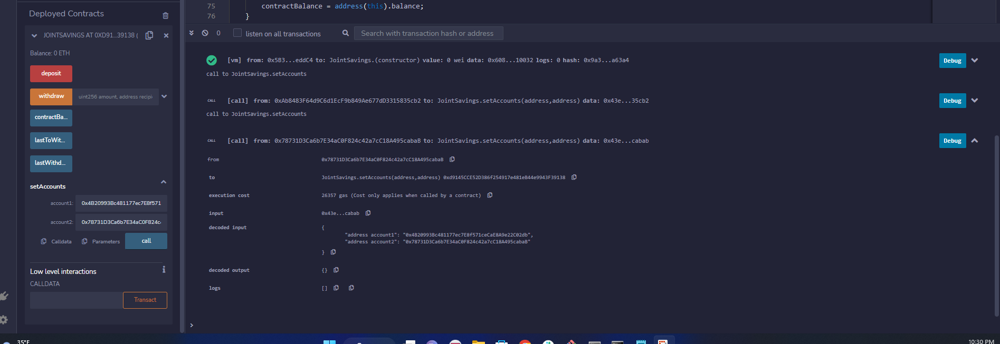
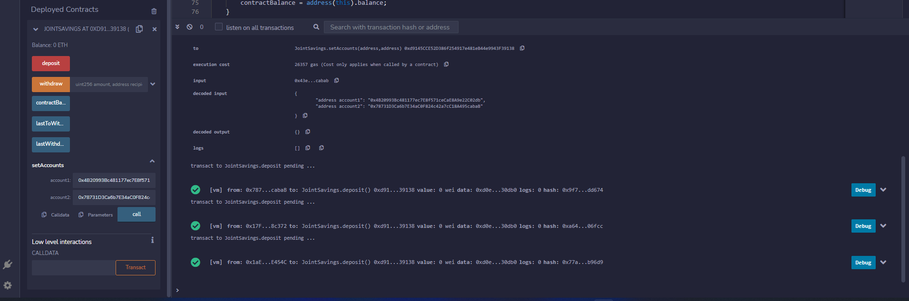
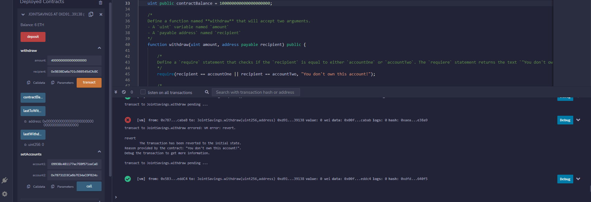
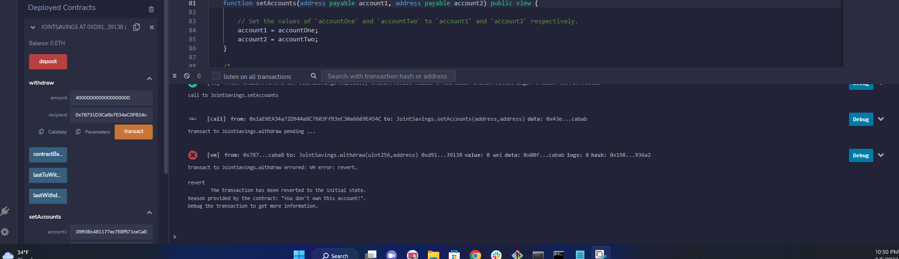
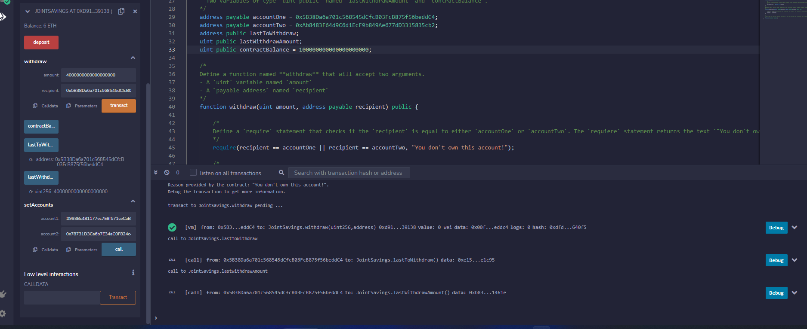

# Module_20_Challenge
Goal: To automate the creation of a joint savings account to hold Ethereum. To accomplish this we will use Solidity to mimic an Ethereum-compatible blockchain. The resulting program will allow us to create the savings account, deposit ETH, and withdraw ETH, as well as keep logs off the previous transactions. 

---

## Technolgies

This application applies Solidity logic through the Remix IDE. 

---

## Installation Guide

The Remix IDE is a web-pased program and requires no installation. The Remix IDE can be found at remix.ethereum.org 

---

## Usage

To begin using this application, navigate to remix.ethereum.org. You will have to save the joint_savings.sol file (found in this repository) to your local macine as well. Once saved, upload the file to Remix, compile and deploy the contract and begin making use of the account. 

---

## Visual Exmaples

Proof of the setAccounts functionality:  
   

Proof of deposit functionality:  
  

Proof of withdrawal functionality:  
  

Proof of withdrawal functionality blocking a non-account owner:  
  

Proof of "Last to Withdraw" functionalities:  
  

---

## Contributors

Shahrukh Alam

---

## License

Columbia Engineering: FinTech Bootcamp